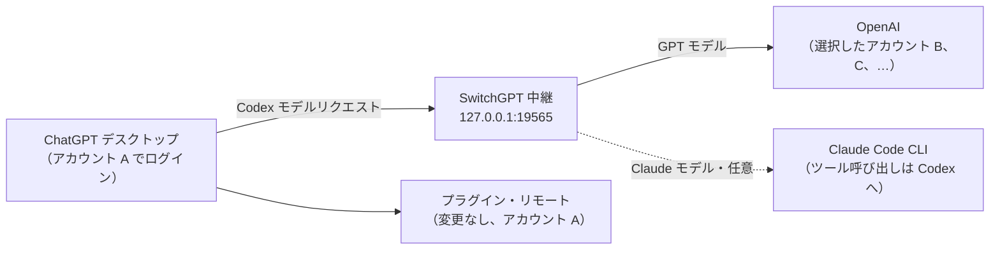

<p align="center">
  
</p>

<h1 align="center">SwitchGPT</h1>

<p align="center">
  <strong>プラグインとリモート接続はそのまま。モデルを実行するアカウントだけを切り替え。</strong>
</p>

<p align="center">
  <a href="https://github.com/yoonpooh/SwitchGPT/releases/latest"></a>
  
  
  
</p>

<p align="center">
  <a href="README.md">English</a> · <a href="README.ko.md">한국어</a> · <strong>日本語</strong> · <a href="README.zh-CN.md">简体中文</a>
</p>

<p align="center">
  <a href="https://github.com/yoonpooh/SwitchGPT/releases/latest">ダウンロード</a> ·
  <a href="#クイックスタート">クイックスタート</a> ·
  <a href="#claude-モデル任意">Claude モデル</a> ·
  <a href="#トラブルシューティング">トラブルシューティング</a> ·
  <a href="https://github.com/yoonpooh/SwitchGPT/releases">変更履歴</a>
</p>

---

SwitchGPT は、ChatGPT デスクトップのログインを維持しながら、Codex のモデルリクエストに使うアカウントを選べる macOS メニューバーアプリです。GitHub などのプラグインやこの Mac へのリモートアクセスは既存の認証を使い続け、モデルリクエストは保存した複数アカウントの残りの利用枠で処理します。この Mac でサインイン済みの Claude Code CLI を通じて、**Fable 5.1、Opus 5.5、Sonnet 5** などの Claude モデルをモデル選択に追加することもできます。

## 目次

- [主な機能](#主な機能)
- [0.4.0 の新機能](#040-の新機能)
- [仕組み](#仕組み)
- [動作要件](#動作要件)
- [インストール](#インストール)
- [クイックスタート](#クイックスタート)
- [使い方](#使い方)
- [自動切り替え](#自動切り替え)
- [Claude モデル（任意）](#claude-モデル任意)
- [プライバシーとローカルデータ](#プライバシーとローカルデータ)
- [トラブルシューティング](#トラブルシューティング)
- [アンインストール](#アンインストール)
- [制限事項](#制限事項)
- [開発](#開発)
- [コントリビュート](#コントリビュート)
- [免責事項](#免責事項)

## 主な機能

- **デスクトップのログインを維持** — 実行アカウントを変えても、プラグイン接続やリモートアクセスに使うデスクトップの認証は保持されます。
- **再起動せずに切り替え** — 初回接続後は、次のモデルリクエストから選択したアカウントを使います。処理中の応答は元のアカウントで完了します。
- **上限到達時に自動切り替え** — 5時間枠・週間枠を使い切ると、リスト順に利用可能な次のアカウントを選びます。
- **実際に処理したアカウントを確認** — 次のリクエストに使うアカウント、直近の応答を完了したアカウント、デスクトップのログインを区別して表示します。
- **利用状況をひと目で** — 保存したアカウントごとに残りの利用枠、リセット時刻、プランのバッジ、プロフィール写真、リセットクレジットを表示します。
- **Claude モデル（任意）** — Claude Code アカウントで使える Claude モデルを ChatGPT のモデル選択から実行します。ツール呼び出しはすべて Codex が実行します。
- **ローカルで完結** — 認証情報は macOS キーチェーンに保存し、リクエストはローカル中継から OpenAI へ直接送ります。SwitchGPT のサーバーはありません。
- **多言語対応** — 英語、韓国語、日本語、中国語（簡体字）。

## 0.4.0 の新機能

- **すべての Claude Code モデル：** Claude Code CLI が提供するモデルのうち各系列の最新モデル（Fable 5.1、Opus 5.5、Sonnet 5、Haiku 4.5 など）をモデル選択に表示し、コンテキストウィンドウは Claude Code の自動圧縮しきい値に合わせます。メニュー名は **Claudeモデルを使用** になりました。[Claude モデル](#claude-モデル任意) を参照してください。
- **Claude プランの利用上限：** ChatGPT アカウントの下の Claude カードに、Claude Code が報告する 5 時間・週間の上限をモデル呼び出しなしで表示します。ChatGPT のプランバッジは Pro と Pro 20x を区別します。
- **Claude モデルの Web 検索：** Codex で Web 検索が有効なとき、Claude モデルは Claude Code の WebSearch でリアルタイムの Web を検索し、Codex の Web 検索カードとして表示します。
- **Codex の権限モードに連動：** Claude Code は Codex で選んだ権限モード（承認を求める、自動レビュー、フルアクセス、プランモード）に従います。
- **Codex での Claude の応答を改善：** 最終回答は書かれるそばからストリーミングされ、進捗メモはコメンタリーとして表示されます。ファイル編集は `apply_patch` で行うため Codex に差分が表示されます。Codex の指示と AGENTS.md は Claude のシステムプロンプトに保持され、`/side` の会話は親の会話と並行して実行されます。

以前の変更は[リリースページ](https://github.com/yoonpooh/SwitchGPT/releases)で確認できます。

## 仕組み



| 接続 | 使用するアカウント |
| --- | --- |
| ChatGPT デスクトップのログイン | 現在のデスクトップアカウント |
| GitHub などの接続済みプラグイン | アプリに接続済みの各サービスのアカウント |
| この Mac へのリモートアクセス | 既存のデスクトップログインとリモート設定 |
| この Mac の Codex モデルリクエスト | SwitchGPT で選択したアカウント |
| Claude モデルのリクエスト（任意） | この Mac の Claude Code CLI のサインイン |

たとえば、デスクトップには A でログインしたまま GitHub 接続とリモート設定を維持し、モデルリクエストを保存済みの B で実行できます。B の利用枠が尽きると、デスクトップのログイン変更やプラグインの再接続なしで C へ自動切り替えできます。

この Mac の標準 `openai` プロバイダーを使う Codex リクエストが対象で、リモート接続を通じてこの Mac で実行するリクエストも含みます。通常の Chat 会話、別のプロバイダー、他のコンピューターやクラウドで実行するモデルリクエストは変更しません。

## 動作要件

- **macOS 14 以降**の Apple シリコン搭載 Mac
- インストール・ログイン済みの現行 **ChatGPT デスクトップアプリ**。標準のファイル形式の認証情報 `~/.codex/auth.json` を使用してください。同梱の CLI を使うため、Codex CLI の別途インストールは不要です。
- 任意：Claude モデルを使う場合は、インストール・サインイン済みの [Claude Code](https://docs.anthropic.com/en/docs/claude-code) CLI

## インストール

### ダウンロード

1. [最新リリース](https://github.com/yoonpooh/SwitchGPT/releases/latest)から `SwitchGPT-v0.4.0-macos-arm64.zip` と `SHA256SUMS.txt` をダウンロードします。
2. 両方のファイルを同じフォルダに置き、チェックサムを確認します。

   ```sh
   shasum -a 256 -c SHA256SUMS.txt
   ```

3. ZIP を展開し、**SwitchGPT.app** を **アプリケーション** に移動します。

### 初回起動

配布版は **ad-hoc 署名**を使用しており、**Apple の公証は受けていません**。macOS が起動をブロックした場合はダウンロード元を確認して起動を試し、表示される場合は **システム設定 → プライバシーとセキュリティ → このまま開く**を使ってください。[Apple の手順](https://support.apple.com/en-ca/guide/mac-help/mh40616/mac)を参照してください。管理対象の Mac では利用が制限される場合があります。

### アップデート

処理中のモデル応答が完了してから `⋯` で SwitchGPT を終了し、アプリケーション内のアプリを置き換えて再度開いてください。保存済みアカウントとキーチェーン項目はアプリバンドル外にあり、保持されます。0.1.x からの更新で案内が表示された場合は、初回接続の手順に従ってください。

### ChatGPT にインストールを依頼する

ローカルファイルとターミナルを使える ChatGPT セッションに貼り付けてください。

```text
https://github.com/yoonpooh/SwitchGPT から最新の SwitchGPT リリースをこの Mac にインストールしてください。Mac が動作要件を満たすか確認し、アプリの ZIP と公開済みの SHA256SUMS.txt をダウンロードして、インストール前にチェックサムを検証してください。保存済みアカウントとキーチェーン項目はすべて保持してください。SwitchGPT が起動中なら、モデル応答の完了を待って終了し、/Applications のアプリを置き換えて再度開いてください。ログイン、アカウント切り替え、ChatGPT の再起動は代行しないでください。macOS が初回起動をブロックしたら、システムのセキュリティ設定を無効にせず、Apple のアプリ単位の「このまま開く」手順を案内してください。
```

## クイックスタート

1. SwitchGPT を開き、メニューバーアイコンをクリックします。通常のウインドウや Dock アイコンはありません。
2. **+** からブラウザでログインしてアカウントを追加します。保存するアカウントごとに繰り返してください。
3. 初回は `⋯` で自動切り替えを無効にし、アカウントカードをクリックします。リスト順を使う場合は自動切り替えを再び有効にします。
4. 案内が表示されたら、進行中の作業を終えてから ChatGPT を再起動します。初回接続時のみ必要です。
5. デスクトップアプリで Codex リクエストを送り、応答が完了することを確認します。

モデル中継を使う間は、メニューバーで SwitchGPT を起動したままにしてください。

## 使い方

- **選択中のアカウント** — リストで強調表示します。手動モードでカードをクリックして変更します。
- **デスクトップログイン** — デスクトップのアカウントを下部に別途表示します。
- **自動切り替え** — `⋯` で初期状態から有効です。ヘッダーに自動・手動を表示します。
- **更新** — 使用量とリセットの利用可能回数を取得します。パネルを閉じても取得完了から60秒後に自動更新します。ログイン中、切り替え中、取得中はスキップします。
- **アカウント管理** — カードをドラッグして順番を変更し、`⋯` または右クリックで名前変更・保存リストからの削除を行います。表示名を空欄にするとメールアドレスに戻ります。リストから削除しても OpenAI アカウント自体は削除されません。

### リセットクレジット

カードの **リセット** で対象アカウントとリセット権1回分の消費を確認して使用できます。現在使用できない場合や取得情報が古い場合はボタンが無効になります。使用後は利用枠と残数を再取得し、自動モードではリストの優先順位を再適用します。応答や使用後の更新に失敗した場合は **結果を確認** で同じリクエストを続けます。未確認のリクエスト番号はアプリ再起動後も保持し、自動では消費しません。

### 言語と日付

日付は Mac のタイムゾーンと表示言語に従います。Mac の優先言語を変えたらアプリを開き直してください。未対応の言語は英語、中国語の地域・文字体系の違いは簡体字で表示します。

## 自動切り替え

1. 最近の取得で利用可能と確認できた先頭のアカウントを優先します。3番を使用中に1番の利用枠が回復した場合、取得で回復を確認した後の次のリクエストから1番を使用します。リセット予定時刻が過ぎただけでは戻りません。
2. サーバーがリクエストを `usage_limit_reached` で拒否した場合、応答を転送する前に利用可能な別アカウントで再試行します。1リクエストにつき各アカウントは最大1回です。
3. 正常にストリーミング中の応答は元のアカウントで完了し、再実行しません。
4. 一時的な速度制限と認証エラーでは切り替えず、そのまま返します。使用量の取得に失敗したアカウントや情報が古いアカウントは切り替え先に選びません。
5. 選択アカウントが上限に達し、利用可能な別アカウントを確認できない場合は停止します。利用枠のリセットを待つか、利用可能なアカウントを選択・追加してください。リセットクレジットは自動消費しません。

`⋯` で自動切り替えを無効にすると、選択アカウントを使い続け、その上限エラーをそのまま返します。自動モードではカードの順番が手動選択より優先され、並べ替えは次のリクエストから反映されます。利用枠はアカウントごとに独立しています。

## Claude モデル（任意）

`⋯` の **Claudeモデルを使用** をオンにすると、アカウントで使える Claude モデルが ChatGPT のモデル選択に追加されます。この Mac でサインイン済みの Claude Code CLI（`~/.local/bin/claude`、`/opt/homebrew/bin/claude`、`/usr/local/bin/claude`）で実行します。SwitchGPT は Anthropic の認証情報を読み取らず、CLI がない場合はスイッチが無効になります。アカウントとプランの上限は Claude Code 自身が報告する値を ChatGPT アカウントの下に表示し、その際モデルは呼び出しません。

モデル一覧は再起動後に更新されるため、切り替え時に ChatGPT を再起動するか確認します。新しい一覧を取得するため `~/.codex/models_cache.json` を削除します。

SwitchGPT は Claude Code に提供モデル（例：Fable 5.1、Opus 5.5、Sonnet 5、Haiku 4.5）を問い合わせ、それぞれ Claude のモデル ID（例：`claude-opus-5-5`）として追加します。一覧は Claude Code の更新時と 6 時間ごとにモデル呼び出しなしで再取得し、次の ChatGPT 再起動でモデル選択に反映されます。各モデルのコンテキストウィンドウには Claude Code の自動コンパクトの閾値（1M モデルは 967K、Haiku は 167K）を伝えるため、ウィンドウの小さいモデルに切り替えた直後も含め、Claude Code より先に Codex がスレッドをコンパクトします。

- **OpenAI の利用枠を消費しない** — Claude のリクエストも同じ中継とデスクトップのログイン確認を通りますが、OpenAI アカウントの選択や利用枠の消費はしません。他のモデルは変わりません。
- **Web 検索以外のツールはすべて Codex が実行** — Claude Code 自身のツールは Web 検索以外使いません。それ以外のツール呼び出しはすべて Codex が現在の権限・承認設定で実行し、結果を同じ Claude プロセスへ返します。
- **コンパクト** — 手動・自動のコンパクトはどちらも 使用中の Claude モデルが要約を作成します。
- **スレッド途中のモデル変更** — Claude モデル同士の切り替えでは全履歴で新しい Claude プロセスを起動し、GPT モデルに切り替えて続けることもできます。OpenAI が拒否する Claude の項目だけを取り除き、Claude のコンパクト要約は読めるメッセージに変換して送ります。逆方向には制限があります。GPT モデルがコンパクトした要約は暗号化されているため、Claude はその後のメッセージから続け、以前の文脈がない場合はそう伝えます。
- **Web 検索** — Codex で Web 検索が有効なとき、Claude モデルは Claude Code 自身の WebSearch を使います。検索は Anthropic のサーバーで実行されて Claude プランの使用量に含まれ、検索ごとに Codex の Web 検索カードとして表示されます。同じスレッドを GPT モデルで続けると、このカードは OpenAI に送られません。回答に書かれた出典はそのまま残ります。Codex の既定の cached モードでも常にライブの Web を検索します。守れないドメイン制限が付いている場合は Web 検索を使いません。
- **ホスト型ツール** — そのほかの OpenAI がホストするツールは Claude モデルでは使えません。どのツールが使えないかは Claude に伝えます。

<details>
<summary>詳細な動作</summary>

- オフの間、Claude のリクエストは OpenAI に送らず SwitchGPT がその場で拒否し、オフにした時点で実行中の Claude タスクも終了します。圧縮されたリクエスト（gzip、deflate、zstd）も同様に扱います。zstd には Homebrew の `zstd` が必要です。オンの間、SwitchGPT が読めないリクエストは転送せずその場で拒否します。
- Claude Code はスレッドのフォルダではなく、空の専用フォルダで実行します。そのため書類フォルダなど保護されたフォルダのスレッドや、プロジェクトなしの新しいチャットでも macOS の許可ダイアログを待ちません。Codex のツールはこれまでどおりスレッドのフォルダで実行します。
- 90 秒以内に Claude Code が起動しない場合や途中で終了した場合、Claude の応答は Claude Code のエラー付きで失敗します。
- `~/.codex/config.toml` で `model_catalog_json` を設定していると、その一覧が SwitchGPT が Claude モデルを追加した一覧の代わりに使われます。Claude モデルをオンにするときに SwitchGPT が警告します。

</details>

## プライバシーとローカルデータ

認証情報は macOS キーチェーンに保存します。実行アカウントを選択しても `~/.codex/auth.json` は保持し、選択したモデルアカウントの認証をメモリへ読み込みます。モデルリクエストは `127.0.0.1:19565` の中継から OpenAI へ直接転送します。外部の SwitchGPT サーバーはありません。

| ローカルデータ | 保存先 |
| --- | --- |
| アカウント一覧と順序 | `~/Library/Application Support/SwitchGPT/accounts.json` |
| 選択したモデルアカウント | `~/Library/Application Support/SwitchGPT/routing-selection.json` |
| 自動切り替え・Claude モデル設定と接続状態 | `~/Library/Application Support/SwitchGPT/routing-preferences.json` |
| 未確認のリセットリクエスト番号 | `~/Library/Application Support/SwitchGPT/reset-credit-attempts.json`（同時保存制御用の `.lock` ファイルを含む） |
| リクエストのメタデータ | `~/Library/Application Support/SwitchGPT/relay-events.jsonl` |
| Claude モデル一覧 | `~/Library/Application Support/SwitchGPT/claude-models.json` |
| 既存のデスクトップ認証 | `~/.codex/auth.json` — 保持 |

`~/.codex/config.toml` の管理ブロックで `openai_base_url` を設定し、以後のリクエストに選択アカウントを適用できるよう HTTP ストリーミングを使います。ローカルログには不透明なアカウント識別値、パス、モデル、HTTP ステータス、完了状態、トークン数、クライアント種別、時刻、利用枠消尽の状態を記録します。**プロンプト、応答内容、認証トークンは記録しません。**

使用量は OpenAI の非公開エンドポイント `chatgpt.com/backend-api/wham/` から取得しており、変更される可能性があります。現在の一覧がない場合は旧保存先のアカウント一覧をコピーし、原本とキーチェーン項目を保持します。

## トラブルシューティング

| 症状 | 対処 |
| --- | --- |
| SwitchGPT 終了後にリクエストが失敗する | アプリを再度開くか、[中継設定を削除](#アンインストール)してください。 |
| 初回接続が保留のまま | 再起動ボタンがあれば使い、デスクトップで実際の Codex リクエストを完了してください。使用量の更新や CLI リクエストだけでは接続を確認しません。 |
| 再ログインが必要 | ブラウザでアカウントを追加し直してください。保存済みアカウントは自動更新され、更新トークンが期限切れ・無効化された場合のみ再ログインが必要です。 |
| 使用量が不明と表示される | 情報がない場合は残量ゼロではなく不明と表示します。**更新**を試してください。 |
| カスタムエンドポイントの競合が表示される | SwitchGPT は他の中継の `openai_base_url` を上書きしません。SwitchGPT で管理する場合は、先に既存の設定を削除してください。 |
| モデル選択に Claude モデルが表示されない | 切り替え後に ChatGPT を再起動し、`~/.codex/config.toml` に `model_catalog_json` があれば削除してください。 |
| Claude のスイッチが無効になっている | 対応パスのいずれかに Claude Code CLI をインストールし、サインインしてください。 |

## アンインストール

1. 進行中の作業を終えます。
2. `~/.codex/config.toml` から `BEGIN/END SwitchGPT model routing` ブロックだけを削除し、他の設定は保持します。
3. ChatGPT を再起動します。
4. `⋯` で SwitchGPT を終了し、アプリを削除します。必要に応じて `~/Library/Application Support/SwitchGPT` と SwitchGPT のキーチェーン項目も削除してください。

アプリだけを削除すると中継設定が残り、ブロックを削除するまでモデルリクエストが失敗します。

## 制限事項

- Apple シリコン版のみ配布し、Intel は未検証です。
- API キー認証、keyring/auto 形式の認証保存、独自の `CODEX_HOME`、他のリモートホストの設定には対応していません。この Mac へのリモート接続は既存設定を維持します。
- この Mac の標準 `openai` プロバイダーと同じ設定を使う CLI セッションにも中継が適用されます。
- アプリの自動アップデーターはありません。現在のデスクトップ認証は Codex が更新し、SwitchGPT が最新情報を同期します。
- ビルド成功は全デスクトップ・macOS バージョンの互換性を保証しません。実際のプラグイン・リモート動作は別途検証が必要です。

## 開発

### ソースからビルド

Swift 6 と macOS SDK を含む Xcode をインストールし、そのコマンドラインツールを選択してから実行します。

```sh
git clone https://github.com/yoonpooh/SwitchGPT.git
cd SwitchGPT
./script/build_and_run.sh --verify
```

`dist/SwitchGPT.app` をビルドし、ad-hoc 署名します。SwitchGPT が起動していなければ、ビルドしたアプリを一時的に起動してそのプロセスを確認し、再び終了します。インストール済みのアプリが起動中なら、19565 番ポートで競合する中継は起動しません。アプリケーションへの自動インストールは行いません。

```sh
./script/build_and_run.sh           # デバッグ版をビルドして起動
./script/build_and_run.sh --verify  # ビルド・署名し、起動中のアプリがなければ一時起動して確認
./script/build_and_run.sh --build   # 起動せずにデバッグ版をビルド
./script/build_and_run.sh --release # 起動せずに最適化版をビルド
swift test                          # テストを実行
```

可能であればリポジトリを iCloud Drive の外に置いてください。同期フォルダで Finder 情報やリソースフォークに関するコード署名エラーが出る場合は、別のビルドパスを使ってください。

```sh
swift test --scratch-path /tmp/switchgpt-tests
```

テストは合成の認証情報と一時ファイルを使い、実際のアカウント切り替え、リセット権の使用、Claude Code の呼び出しは行いません。実際の認証とサーバー互換性は別途検証が必要です。

### リリースのパッケージ化

スクリプトはビルドする Mac のアーキテクチャ向けにビルドします。公開する成果物は Apple シリコン版です。

```sh
./script/build_and_run.sh --release
ditto -c -k --norsrc --keepParent dist/SwitchGPT.app dist/SwitchGPT-v0.4.0-macos-arm64.zip
(cd dist && shasum -a 256 SwitchGPT-v0.4.0-macos-arm64.zip > SHA256SUMS.txt)
```

### プロジェクト構成

```text
favicon.png                     リポジトリのロゴ
Assets/                         アプリとメニューバーのアイコン
Sources/SwitchGPT/
  App/                          メニューバーアプリのエントリポイント
  Models/                       アカウント・使用量・中継設定モデルと多言語処理
  Resources/                    英語・韓国語・日本語・中国語（簡体字）の文言
  Services/                     中継・ルーティング・ログイン・キーチェーン・使用量・Claude Code 連携
  Stores/                       アカウントの状態と順序
  Views/                        アカウントパネルと使用量表示
Tests/SwitchGPTTests/           ユニットテスト
script/build_and_run.sh         ビルドとアプリのパッケージ化
```

## コントリビュート

Issue とプルリクエストを歓迎します。作成する前に次を確認してください。

- `swift test` を実行し、成功することを確認してください。
- ユーザー向けの文言は 4 つの `Localizable.strings` すべてに反映し、ドキュメントを変更したらすべての README の翻訳も更新してください。
- Issue、プルリクエスト、コミットに**認証情報、アカウント一覧、個人アカウントが見えるスクリーンショットを絶対に含めないでください。**

## 免責事項

SwitchGPT は独立したユーティリティであり、OpenAI および Anthropic と提携しておらず、その承認も受けていません。ChatGPT、Codex、Claude、Claude Code は各所有者の商標です。SwitchGPT は予告なく変更される可能性のある非公開エンドポイントとデスクトップアプリの動作に依存しているため、ご自身の責任でご利用ください。
