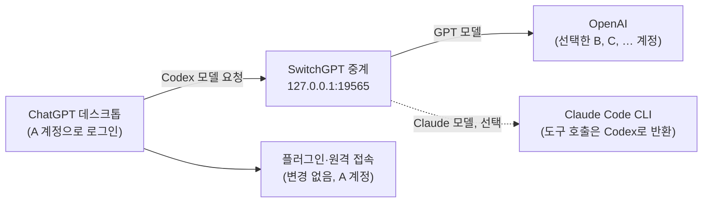

<p align="center">
  
</p>

<h1 align="center">SwitchGPT</h1>

<p align="center">
  <strong>플러그인과 원격 연결은 그대로, 모델 실행 계정만 전환하세요.</strong>
</p>

<p align="center">
  <a href="https://github.com/yoonpooh/SwitchGPT/releases/latest"></a>
  
  
  
</p>

<p align="center">
  <a href="README.md">English</a> · <strong>한국어</strong> · <a href="README.ja.md">日本語</a> · <a href="README.zh-CN.md">简体中文</a>
</p>

<p align="center">
  <a href="https://github.com/yoonpooh/SwitchGPT/releases/latest">다운로드</a> ·
  <a href="#빠른-시작">빠른 시작</a> ·
  <a href="#claude-모델-선택">Claude 모델</a> ·
  <a href="#문제-해결">문제 해결</a> ·
  <a href="https://github.com/yoonpooh/SwitchGPT/releases">변경 기록</a>
</p>

---

SwitchGPT는 ChatGPT 데스크톱의 로그인 계정을 유지하면서 Codex 모델 요청에 사용할 계정만 전환하는 macOS 메뉴 막대 앱입니다. GitHub 등의 플러그인과 이 Mac으로의 원격 접속은 기존 인증을 그대로 사용하고, 모델 요청은 저장한 여러 계정의 남은 사용량으로 처리합니다. 이 Mac에 로그인된 Claude Code CLI를 통해 **Fable 5.1, Opus 5.5, Sonnet 5** 같은 Claude 모델을 모델 선택기에 추가할 수도 있습니다.

## 목차

- [주요 기능](#주요-기능)
- [0.3.0의 새로운 기능](#030의-새로운-기능)
- [동작 방식](#동작-방식)
- [요구 사항](#요구-사항)
- [설치](#설치)
- [빠른 시작](#빠른-시작)
- [사용 방법](#사용-방법)
- [자동 전환](#자동-전환)
- [Claude 모델 (선택)](#claude-모델-선택)
- [개인정보와 로컬 데이터](#개인정보와-로컬-데이터)
- [문제 해결](#문제-해결)
- [제거](#제거)
- [제한 사항](#제한-사항)
- [개발](#개발)
- [기여하기](#기여하기)
- [면책 조항](#면책-조항)

## 주요 기능

- **데스크톱 로그인 유지** — 모델 실행 계정을 바꿔도 플러그인 연결과 원격 접속에 사용하는 데스크톱 인증을 유지합니다.
- **재시작 없는 계정 전환** — 최초 연결 이후에는 다음 모델 요청부터 선택한 계정을 사용합니다. 이미 진행 중인 응답은 원래 계정으로 완료합니다.
- **한도 소진 시 자동 전환** — 5시간·주간 한도가 소진되면 목록 순서대로 사용 가능한 다음 계정을 선택합니다.
- **실제 처리 계정 확인** — 다음 요청에 사용할 계정, 최근 응답을 완료한 계정, 데스크톱 로그인 계정을 구분해 표시합니다.
- **한눈에 보는 사용량** — 저장한 계정마다 남은 사용량, 초기화 시각, 요금제 배지, 프로필 사진, 초기화 크레딧을 표시합니다.
- **Claude 모델 (선택)** — Claude Code 계정에서 쓸 수 있는 Claude 모델을 ChatGPT 모델 선택기에서 실행하며, 도구 호출은 모두 Codex가 실행합니다.
- **로컬 전용** — 인증 정보는 macOS 키체인에 저장하고, 요청은 로컬 중계를 거쳐 OpenAI로 직접 전달합니다. SwitchGPT 서버는 없습니다.
- **다국어 지원** — 영어, 한국어, 일본어, 중국어 간체.

## 0.3.0의 새로운 기능

- **Claude 모델 (선택):** `⋯`에서 **Claude 모델 사용**을 켜면 Claude Code CLI가 제공하는 모델이 ChatGPT 모델 선택기에 추가됩니다. 로그인된 Claude Code CLI로 실행하므로 OpenAI 한도를 쓰지 않으며, 모든 도구 호출은 Codex로 돌아가 기존 권한·승인 설정이 그대로 적용됩니다. [Claude 모델](#claude-모델-선택)을 참고하세요.

이전 변경 사항은 [릴리스 페이지](https://github.com/yoonpooh/SwitchGPT/releases)에서 확인할 수 있습니다.

## 동작 방식



| 연결 | 사용하는 계정 |
| --- | --- |
| ChatGPT 데스크톱 로그인 | 현재 로그인된 데스크톱 계정 |
| GitHub 등 연결된 플러그인 | 앱에 이미 연결해 둔 각 서비스 계정 |
| 이 Mac으로의 원격 접속 | 기존 데스크톱 로그인과 원격 연결 설정 |
| 이 Mac의 Codex 모델 요청 | SwitchGPT에서 선택한 계정 |
| Claude 모델 요청 (선택) | 이 Mac의 Claude Code CLI 로그인 |

예를 들어 데스크톱은 A 계정으로 로그인한 채 GitHub 연결과 원격 설정을 유지하고, 모델 요청은 저장된 B 계정으로 처리할 수 있습니다. B의 한도가 소진되면 데스크톱 로그인을 바꾸거나 플러그인을 다시 연결하지 않고 C 계정으로 자동 전환할 수 있습니다.

이 Mac의 기본 `openai` 제공자를 사용하는 Codex 요청에 적용되며, 원격으로 이 Mac에 접속해 실행하는 요청도 포함합니다. 일반 Chat 대화, 별도 제공자, 다른 컴퓨터나 클라우드에서 실행되는 모델 요청은 변경하지 않습니다.

## 요구 사항

- **macOS 14 이상**의 Apple silicon Mac
- 설치 및 로그인이 완료된 현재 **ChatGPT 데스크톱 앱**. 기본 파일 기반 인증 저장 경로인 `~/.codex/auth.json`을 사용해야 합니다. 데스크톱 앱에 포함된 CLI를 사용하므로 별도 Codex CLI 설치는 필요하지 않습니다.
- 선택: Claude 모델을 사용하려면 설치 및 로그인이 완료된 [Claude Code](https://docs.anthropic.com/en/docs/claude-code) CLI

## 설치

### 다운로드

1. [최신 릴리스](https://github.com/yoonpooh/SwitchGPT/releases/latest)에서 `SwitchGPT-v0.3.0-macos-arm64.zip`과 `SHA256SUMS.txt`를 다운로드합니다.
2. 두 파일을 같은 폴더에 두고 체크섬을 확인합니다.

   ```sh
   shasum -a 256 -c SHA256SUMS.txt
   ```

3. ZIP 압축을 풀고 **SwitchGPT.app**을 **응용 프로그램** 폴더로 옮깁니다.

### 첫 실행

배포본은 **ad-hoc 서명**을 사용하며 **Apple 공증을 받지 않았습니다**. macOS가 실행을 차단하면 다운로드한 파일을 확인하고 앱 실행을 시도한 뒤, 해당 옵션이 나타나는 경우 **시스템 설정 → 개인정보 보호 및 보안 → 확인 없이 열기**를 사용하세요. [Apple 안내](https://support.apple.com/en-ca/guide/mac-help/mh40616/mac)를 참고하세요. 조직에서 관리하는 Mac에서는 이 옵션이 제한될 수 있습니다.

### 업데이트

진행 중인 모델 응답을 마치고 `⋯`에서 SwitchGPT를 종료한 뒤, 응용 프로그램 폴더의 앱을 새 버전으로 교체하고 다시 실행하세요. 저장된 계정과 키체인 항목은 앱 번들 외부에 보관되어 유지됩니다. 0.1.x에서 업데이트한 경우 안내가 나오면 최초 연결 과정을 진행하세요.

### ChatGPT에 설치 요청하기

로컬 파일과 터미널 도구를 사용할 수 있는 ChatGPT 세션에 붙여넣으세요.

```text
https://github.com/yoonpooh/SwitchGPT 에서 최신 SwitchGPT 릴리스를 이 Mac에 설치해 줘. 릴리스가 내 Mac을 지원하는지 확인하고, 앱 ZIP과 함께 게시된 SHA256SUMS.txt를 다운로드한 다음 설치 전에 체크섬을 검증해 줘. 기존에 저장된 계정과 키체인 항목은 모두 보존해 줘. SwitchGPT가 실행 중이면 진행 중인 모델 응답이 끝난 뒤 앱을 종료하고 /Applications의 앱을 교체한 다음 다시 실행해 줘. 대신 로그인하거나 계정을 전환하거나 ChatGPT를 재시작하지는 마. macOS가 첫 실행을 차단하면 시스템 보안 설정을 비활성화하지 말고 Apple의 앱별 '확인 없이 열기' 절차를 안내해 줘.
```

## 빠른 시작

1. SwitchGPT를 실행하고 메뉴 막대 아이콘을 클릭합니다. SwitchGPT는 일반 창이나 Dock 아이콘이 없습니다.
2. **+**를 눌러 브라우저 로그인으로 계정을 추가합니다. 저장할 계정마다 반복하세요.
3. 최초 계정 선택은 `⋯`에서 자동 전환을 끈 뒤 계정 카드를 클릭하세요. 목록 순서를 따르려면 자동 전환을 다시 켜세요.
4. 안내가 나오면 진행 중인 작업을 마친 뒤 ChatGPT를 재시작하세요. 최초 연결에만 필요합니다.
5. 데스크톱 앱에서 Codex 요청을 보내 응답이 완료되는지 확인합니다.

모델 중계를 사용하는 동안 SwitchGPT를 메뉴 막대에서 계속 실행해 두세요.

## 사용 방법

- **선택 계정** — 목록에서 강조 표시합니다. 수동 모드에서 카드를 눌러 변경합니다.
- **데스크톱 로그인** — 데스크톱에 로그인된 계정을 하단에 별도로 표시합니다.
- **자동 전환** — `⋯`에서 기본으로 켜져 있으며, 헤더에 자동·수동을 표시합니다.
- **새로 고침** — 사용량과 초기화 가능 횟수를 조회합니다. 패널을 닫아도 조회 완료 후 60초마다 자동 갱신하며, 로그인·계정 전환 중이거나 조회가 진행 중이면 건너뜁니다.
- **계정 관리** — 카드를 드래그해 순서를 바꾸고, `⋯` 또는 카드 우클릭으로 이름 변경·저장 목록 삭제를 진행합니다. 표시 이름을 비우면 이메일로 돌아갑니다. 저장 목록에서 삭제해도 OpenAI 계정 자체는 삭제되지 않습니다.

### 초기화 크레딧

계정 카드의 **초기화**를 누르고 대상 계정·리셋권 1장 소모를 확인하면 리셋권을 사용할 수 있습니다. 현재 사용할 수 없거나 조회 정보가 오래되었으면 버튼이 비활성화됩니다. 사용 후 한도와 보유 수를 다시 조회하며, 자동 전환이 켜져 있으면 목록 우선순위를 다시 적용합니다. 응답이 끊기거나 후속 조회에 실패하면 **결과 확인**으로 같은 요청을 이어갑니다. 앱을 다시 실행해도 미확인 요청 번호를 유지하며 리셋권을 자동 소모하지 않습니다.

### 언어와 날짜

날짜는 Mac의 시간대와 표시 언어를 따릅니다. Mac의 기본 언어를 바꾼 뒤에는 앱을 다시 여세요. 지원하지 않는 언어는 영어로 표시하고, 중국어의 다른 지역·문자 변형은 간체로 표시합니다.

## 자동 전환

1. 최근 조회에서 사용 가능하다고 확인된 가장 앞 계정을 우선합니다. 3번 계정 사용 중 1번의 한도가 회복되면, 조회로 회복을 확인한 뒤 다음 요청부터 1번을 사용합니다. 초기화 예정 시간이 지났다는 이유만으로 복귀하지 않습니다.
2. 서버가 요청을 `usage_limit_reached`로 거절하면, 응답을 전달하기 전에 다른 사용 가능한 계정으로 다시 시도합니다. 요청 하나당 각 계정은 최대 한 번만 시도합니다.
3. 이미 스트리밍 중인 정상 응답은 원래 계정으로 완료하며 재실행하지 않습니다.
4. 일시적인 요청 속도 제한과 인증 오류는 자동 전환 없이 반환합니다. 조회에 실패했거나 사용량 정보가 오래된 계정은 대체 계정으로 선택하지 않습니다.
5. 선택 계정이 소진되었고 사용 가능한 대체 계정을 확인할 수 없으면 요청을 중단합니다. 한도가 초기화되기를 기다리거나, 사용 가능한 계정을 선택·추가하세요. 초기화 크레딧은 자동 소모하지 않습니다.

`⋯`에서 자동 전환을 끄면 선택 계정을 계속 사용하며 해당 계정의 한도 오류를 그대로 반환합니다. 자동 모드에서는 카드 순서가 수동 선택보다 우선하며, 순서를 바꾸면 다음 요청에 반영됩니다. 계정별 한도는 각각 별도로 유지됩니다.

## Claude 모델 (선택)

`⋯`에서 **Claude 모델 사용**을 켜면 계정에서 쓸 수 있는 Claude 모델이 ChatGPT 모델 선택기에 추가됩니다. 이 Mac에 이미 로그인된 Claude Code CLI(`~/.local/bin/claude`, `/opt/homebrew/bin/claude`, `/usr/local/bin/claude`)로 실행합니다. SwitchGPT는 Anthropic 인증 정보를 읽지 않으며, CLI가 없으면 토글이 비활성화됩니다. 계정과 요금제 한도는 Claude Code가 직접 알려 주는 값으로 ChatGPT 계정 아래에 표시되며, 이때 모델은 호출하지 않습니다.

모델 목록은 재시작해야 갱신되므로, 토글을 바꾸면 ChatGPT 재시작 여부를 묻습니다. 새 목록을 받도록 `~/.codex/models_cache.json`을 지웁니다.

SwitchGPT는 Claude Code에 제공 모델(예: Fable 5.1, Opus 5.5, Sonnet 5, Haiku 4.5)을 물어 각각 `claude-code-<모델>`로 추가합니다. 목록은 Claude Code가 업데이트되거나 6시간이 지나면 모델 호출 없이 다시 조회하며, 다음 ChatGPT 재시작 때 선택기에 반영됩니다. 각 모델의 컨텍스트 창은 Claude Code의 자동 압축 기준(1M 모델은 967K, Haiku는 167K)으로 알리므로, 창이 더 작은 모델로 바꾼 직후를 포함해 Claude Code보다 Codex가 먼저 스레드를 압축합니다.

- **OpenAI 한도 사용 안 함** — Claude 요청도 같은 중계와 데스크톱 로그인 확인을 거치지만, OpenAI 계정을 고르거나 한도를 쓰지 않습니다. 다른 모델은 그대로입니다.
- **웹 검색을 뺀 도구는 모두 Codex가 실행** — Claude Code에는 웹 검색 외의 자체 도구를 주지 않습니다. 그 밖의 도구 호출은 모두 Codex로 돌아가 현재 권한·승인 설정으로 실행되고, 결과는 같은 Claude 프로세스로 전달됩니다.
- **압축** — 수동·자동 압축 모두 사용 중인 Claude 모델이 요약을 작성합니다.
- **스레드 중간 모델 변경** — Claude 모델끼리 바꾸면 전체 기록으로 새 Claude 프로세스를 시작하고, GPT 모델로 바꿔 이어 쓸 수도 있습니다. OpenAI가 거절하는 Claude 항목만 걸러 내고, Claude가 쓴 압축 요약은 읽을 수 있는 메시지로 바꿔 보냅니다. 반대 방향은 제한이 있습니다. GPT 모델이 압축한 요약은 암호화되어 있어 Claude는 그 이후 메시지부터 이어 가며, 이전 맥락이 없으면 그렇다고 알립니다.
- **웹 검색** — Codex에서 웹 검색이 켜져 있으면 Claude 모델은 Claude Code 자체 WebSearch를 씁니다. 검색은 Anthropic 서버에서 실행되어 Claude 요금제 사용량에 포함되고, 검색할 때마다 Codex 웹 검색 카드로 표시됩니다. 같은 대화를 GPT 모델로 이어 가면 이 카드는 OpenAI로 보내지 않으며, 답변에 적힌 출처는 그대로 남습니다. Codex 기본값인 cached 모드에서도 항상 실시간 웹을 검색하며, 지킬 수 없는 도메인 제한이 붙으면 웹 검색을 쓰지 않습니다.
- **호스팅 도구** — 그 밖의 OpenAI 호스팅 도구는 Claude 모델에서 쓸 수 없으며, 어떤 도구가 빠졌는지 Claude에게 알려 줍니다.

<details>
<summary>세부 동작</summary>

- 토글이 꺼져 있으면 Claude 요청을 OpenAI로 보내지 않고 SwitchGPT가 바로 거절하며, 끄는 즉시 진행 중인 Claude 작업도 끝냅니다. 압축된 요청(gzip, deflate, zstd)도 똑같이 처리합니다. zstd는 Homebrew의 `zstd`가 필요하며, 토글이 켜져 있을 때 SwitchGPT가 읽지 못한 요청은 넘기지 않고 바로 거절합니다.
- Claude Code는 스레드 폴더가 아닌 빈 전용 폴더에서 실행됩니다. 그래서 문서 폴더처럼 보호된 폴더의 스레드나 프로젝트 없는 새 채팅에서도 macOS 권한 창을 기다리지 않습니다. Codex 도구는 그대로 스레드 폴더에서 실행됩니다.
- Claude Code가 90초 안에 시작되지 않거나 도중에 종료되면 Claude 응답은 Claude Code의 오류 메시지와 함께 실패합니다.
- `~/.codex/config.toml`에 `model_catalog_json`이 있으면 그 목록이 SwitchGPT가 Claude 모델을 추가한 목록을 대신합니다. Claude 모델을 켤 때 SwitchGPT가 이를 경고합니다.

</details>

## 개인정보와 로컬 데이터

인증 정보는 macOS 키체인에 저장합니다. 실행 계정을 선택해도 `~/.codex/auth.json`은 유지하며, 선택한 모델 계정의 인증을 메모리로 읽습니다. 모델 요청은 `127.0.0.1:19565`의 중계를 거쳐 OpenAI로 직접 전달되며, 외부 SwitchGPT 서버는 없습니다.

| 로컬 데이터 | 저장 위치 |
| --- | --- |
| 계정 목록과 순서 | `~/Library/Application Support/SwitchGPT/accounts.json` |
| 선택한 모델 계정 | `~/Library/Application Support/SwitchGPT/routing-selection.json` |
| 자동 전환·Claude 모델 설정과 연결 확인 상태 | `~/Library/Application Support/SwitchGPT/routing-preferences.json` |
| 미확인 리셋권 요청 번호 | `~/Library/Application Support/SwitchGPT/reset-credit-attempts.json` (동시 저장 제어용 `.lock` 파일 포함) |
| 요청 메타데이터 | `~/Library/Application Support/SwitchGPT/relay-events.jsonl` |
| Claude 모델 목록 | `~/Library/Application Support/SwitchGPT/claude-models.json` |
| 기존 데스크톱 인증 정보 | `~/.codex/auth.json` — 유지 |

`~/.codex/config.toml`의 관리 블록에 `openai_base_url`을 설정하고, 다음 요청부터 선택한 계정을 사용하도록 HTTP 스트리밍을 사용합니다. 로컬 로그에는 불투명한 계정 식별값, 요청 경로, 모델, HTTP 상태, 완료 여부, 토큰 수, 클라이언트 종류, 처리 시각과 한도 소진 여부를 기록합니다. **프롬프트·응답 내용·인증 토큰은 기록하지 않습니다.**

사용량은 OpenAI의 비공개 `chatgpt.com/backend-api/wham/` 엔드포인트에서 조회하며, 이 엔드포인트는 변경될 수 있습니다. 현재 계정 목록이 없으면 이전 저장 위치의 목록을 복사하며, 원본 파일과 키체인 항목은 보존합니다.

## 문제 해결

| 증상 | 해결 방법 |
| --- | --- |
| SwitchGPT 종료 후 요청이 실패함 | 다시 실행하거나 [중계 설정을 제거](#제거)하세요. |
| 최초 연결이 계속 대기 중임 | 재시작 버튼이 보이면 사용한 뒤 데스크톱에서 실제 Codex 요청을 완료하세요. 사용량 조회나 CLI 요청만으로는 데스크톱 연결이 확인되지 않습니다. |
| 계정에 다시 로그인해야 함 | 브라우저를 통해 해당 계정을 다시 추가하세요. 저장 계정은 자동 갱신되며, 갱신 토큰이 만료·폐기된 경우에만 재로그인이 필요합니다. |
| 사용량이 확인 불가로 표시됨 | 없는 정보는 남은 사용량 0이 아니라 확인 불가로 표시합니다. **새로 고침**을 시도하세요. |
| 사용자 지정 엔드포인트 충돌 안내가 나옴 | SwitchGPT는 다른 중계의 `openai_base_url`을 덮어쓰지 않습니다. SwitchGPT로 관리하려면 기존 설정을 먼저 제거하세요. |
| 모델 선택기에 Claude 모델이 보이지 않음 | 토글을 바꾼 뒤 ChatGPT를 재시작하고, `~/.codex/config.toml`에 `model_catalog_json`이 있으면 제거하세요. |
| Claude 토글이 비활성화됨 | 지원하는 경로 중 하나에 Claude Code CLI를 설치하고 로그인하세요. |

## 제거

1. 진행 중인 작업을 마칩니다.
2. `~/.codex/config.toml`에서 `BEGIN/END SwitchGPT model routing` 블록만 제거하고 다른 설정은 유지합니다.
3. ChatGPT를 다시 시작합니다.
4. `⋯`에서 SwitchGPT를 종료하고 앱을 삭제합니다. 필요하면 `~/Library/Application Support/SwitchGPT`와 SwitchGPT 키체인 항목도 삭제하세요.

앱 번들만 삭제하면 중계 설정이 남아, 블록을 제거할 때까지 모델 요청이 실패합니다.

## 제한 사항

- Apple silicon 빌드만 배포하며 Intel은 검증하지 않았습니다.
- API 키 인증, keyring/auto 인증 저장 방식, 사용자 지정 `CODEX_HOME`, 다른 원격 호스트의 설정은 지원하지 않습니다. 이 Mac으로의 원격 접속은 기존 설정을 유지합니다.
- 같은 Mac의 기본 `openai` 제공자와 설정을 사용하는 CLI 세션에도 중계가 적용됩니다.
- 앱 자체의 자동 업데이트 기능은 없습니다. 현재 데스크톱 세션의 토큰 갱신은 Codex가 담당하며 SwitchGPT는 최신 인증 정보를 동기화합니다.
- 빌드 성공이 모든 데스크톱·macOS 버전의 호환성을 보장하지는 않습니다. 실제 플러그인·원격 동작은 별도로 검증해야 합니다.

## 개발

### 소스에서 빌드

Swift 6와 macOS SDK가 포함된 Xcode를 설치하고 해당 명령줄 도구를 선택한 뒤 실행하세요.

```sh
git clone https://github.com/yoonpooh/SwitchGPT.git
cd SwitchGPT
./script/build_and_run.sh --verify
```

`dist/SwitchGPT.app`을 빌드하고 ad-hoc 서명합니다. SwitchGPT가 실행 중이 아니면 빌드한 앱을 잠시 실행해 해당 프로세스를 확인한 뒤 종료합니다. 설치된 앱이 실행 중이면 19565 포트에서 경쟁하는 중계를 띄우지 않습니다. 응용 프로그램 폴더에 자동 설치하지는 않습니다.

```sh
./script/build_and_run.sh           # 디버그 앱 빌드 및 실행
./script/build_and_run.sh --verify  # 빌드·서명, 실행 중인 앱이 없을 때만 잠시 실행해 확인
./script/build_and_run.sh --build   # 실행하지 않고 디버그 앱 빌드
./script/build_and_run.sh --release # 실행하지 않고 최적화된 앱 빌드
swift test                          # 테스트 실행
```

가능하면 저장소를 iCloud Drive 외부에 두세요. 동기화 폴더에서 Finder 정보 또는 리소스 포크 관련 코드 서명 오류가 발생하면 별도 빌드 경로를 사용하세요.

```sh
swift test --scratch-path /tmp/switchgpt-tests
```

테스트는 합성 인증 정보와 임시 파일을 사용하며, 실제 계정 전환·리셋권 사용·Claude Code 호출을 하지 않습니다. 실제 인증과 서버 호환성은 별도로 검증해야 합니다.

### 릴리스 패키징

스크립트는 빌드하는 Mac의 아키텍처를 대상으로 합니다. 공개 배포 파일은 Apple silicon 빌드입니다.

```sh
./script/build_and_run.sh --release
ditto -c -k --norsrc --keepParent dist/SwitchGPT.app dist/SwitchGPT-v0.3.0-macos-arm64.zip
(cd dist && shasum -a 256 SwitchGPT-v0.3.0-macos-arm64.zip > SHA256SUMS.txt)
```

### 프로젝트 구조

```text
favicon.png                     저장소 로고
Assets/                         앱 및 메뉴 막대 아이콘
Sources/SwitchGPT/
  App/                          메뉴 막대 앱 진입점
  Models/                       계정·사용량·중계 설정 모델과 다국어 처리
  Resources/                    영어·한국어·일본어·중국어 간체 문구
  Services/                     중계·라우팅·로그인·키체인·사용량·Claude Code 연동
  Stores/                       계정 상태와 순서
  Views/                        계정 패널과 사용량 표시
Tests/SwitchGPTTests/           단위 테스트
script/build_and_run.sh         빌드 및 앱 패키징 진입점
```

## 기여하기

이슈와 풀 리퀘스트를 환영합니다. 올리기 전에 다음을 확인하세요.

- `swift test`를 실행해 통과하는지 확인하세요.
- 사용자에게 보이는 문구는 네 개의 `Localizable.strings` 파일 모두에 반영하고, 문서를 바꾸면 모든 README 번역본을 함께 수정하세요.
- 이슈, 풀 리퀘스트, 커밋에 **인증 정보, 계정 목록, 개인 계정이 드러나는 스크린샷을 절대 포함하지 마세요.**

## 면책 조항

SwitchGPT는 독립적인 유틸리티로, OpenAI 또는 Anthropic과 제휴하거나 승인을 받은 제품이 아닙니다. ChatGPT, Codex, Claude, Claude Code는 각 소유자의 상표입니다. SwitchGPT는 예고 없이 바뀔 수 있는 비공개 엔드포인트와 데스크톱 앱 동작에 의존하므로, 사용에 따른 책임은 사용자에게 있습니다.
