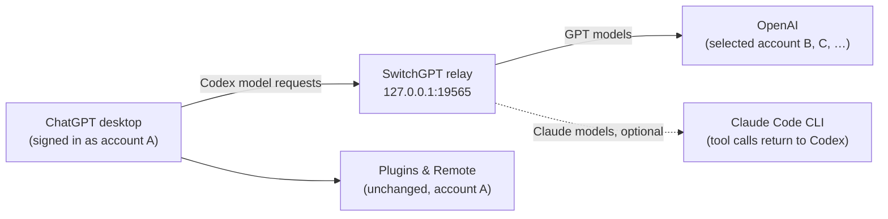

<p align="center">
  
</p>

<h1 align="center">SwitchGPT</h1>

<p align="center">
  <strong>Keep your plugins and Remote connection. Switch only the account running your models.</strong>
</p>

<p align="center">
  <a href="https://github.com/yoonpooh/SwitchGPT/releases/latest"></a>
  
  
  
</p>

<p align="center">
  <strong>English</strong> · <a href="README.ko.md">한국어</a> · <a href="README.ja.md">日本語</a> · <a href="README.zh-CN.md">简体中文</a>
</p>

<p align="center">
  <a href="https://github.com/yoonpooh/SwitchGPT/releases/latest">Download</a> ·
  <a href="#quick-start">Quick start</a> ·
  <a href="#claude-models-optional">Claude models</a> ·
  <a href="#troubleshooting">Troubleshooting</a> ·
  <a href="https://github.com/yoonpooh/SwitchGPT/releases">Changelog</a>
</p>

---

SwitchGPT is a macOS menu bar app that keeps your ChatGPT desktop account signed in while choosing which account handles Codex model requests. Plugins such as GitHub and Remote access to this Mac keep their existing sign-in, while model requests use the remaining quota of your saved accounts. You can also add Claude models such as **Fable 5.1, Opus 5.5, and Sonnet 5** to the model picker through the Claude Code CLI already signed in on your Mac.

## Contents

- [Features](#features)
- [What's new in 0.4.0](#whats-new-in-040)
- [How it works](#how-it-works)
- [Requirements](#requirements)
- [Installation](#installation)
- [Quick start](#quick-start)
- [Usage](#usage)
- [Automatic switching](#automatic-switching)
- [Claude models (optional)](#claude-models-optional)
- [Privacy and local data](#privacy-and-local-data)
- [Troubleshooting](#troubleshooting)
- [Uninstall](#uninstall)
- [Limitations](#limitations)
- [Development](#development)
- [Contributing](#contributing)
- [Disclaimer](#disclaimer)

## Features

- **Keep desktop sign-in** — choosing a model account preserves the desktop credentials used by plugin connections and Remote access.
- **Switch without restarting** — after initial setup, account changes apply to the next model request. Responses already in progress finish with their original account.
- **Switch automatically at the limit** — when the 5-hour or weekly quota is exhausted, SwitchGPT selects the next available account in your list order.
- **See what actually ran** — the panel separates the next request account, the account that last completed a response, and your desktop sign-in.
- **Usage at a glance** — remaining usage, reset times, plan badges, profile photos, and reset credits for every saved account.
- **Optional Claude models** — run the Claude models your Claude Code account offers from the ChatGPT model picker, with every tool call executed by Codex.
- **Local and private** — credentials stay in macOS Keychain, and requests go directly to OpenAI through a local relay. There is no SwitchGPT server.
- **Localized** — English, Korean, Japanese, and Simplified Chinese.

## What's new in 0.4.0

- **Every Claude Code model:** the picker lists the newest model of each family your Claude Code CLI offers, such as Fable 5.1, Opus 5.5, Sonnet 5, and Haiku 4.5, with context windows that match Claude Code's auto-compact threshold. The toggle is now **Use Claude models**. See [Claude models](#claude-models-optional).
- **Claude plan limits:** a Claude card below the ChatGPT accounts shows the 5-hour and weekly limits as Claude Code reports them, without a model call. ChatGPT plan badges now tell Pro and Pro 20x apart.
- **Web search for Claude models:** while Codex offers web search, Claude models search the live web with Claude Code's WebSearch, shown as Codex web search cards.
- **Codex permission mode:** Claude Code follows the permission mode chosen in Codex: ask for approval, auto review, full access, or plan mode.
- **Better Claude replies in Codex:** final answers stream as they are written, progress notes appear as commentary, and file edits go through `apply_patch` so Codex shows their diffs. Codex instructions and AGENTS.md stay in Claude's system prompt, and `/side` conversations run beside their parent.

Earlier changes are listed on the [Releases page](https://github.com/yoonpooh/SwitchGPT/releases).

## How it works



| Connection | Account used |
| --- | --- |
| ChatGPT desktop sign-in | Your existing desktop account |
| Connected plugins, such as GitHub | The service account already connected to the app |
| Remote access to this Mac | Your existing desktop sign-in and Remote setup |
| Codex model requests on this Mac | The account selected in SwitchGPT |
| Claude model requests (optional) | The Claude Code CLI sign-in on this Mac |

For example, keep desktop account A signed in with its GitHub connection and Remote setup, and run model requests with saved account B. When B reaches its limit, automatic switching can select C without changing desktop sign-in or reconnecting plugins.

Routing applies to Codex requests that use the built-in `openai` provider on this Mac, including Remote requests executed on this Mac. It does not change ordinary Chat conversations, separate providers, or model requests executed on other computers or in the cloud.

## Requirements

- Apple silicon Mac running **macOS 14 or later**
- The current **ChatGPT desktop app**, installed and signed in, using the default file-based credential store at `~/.codex/auth.json`. SwitchGPT uses the app's bundled CLI; no separate Codex CLI installation is required.
- Optional: the [Claude Code](https://docs.anthropic.com/en/docs/claude-code) CLI, installed and signed in, to use Claude models

## Installation

### Download

1. Download `SwitchGPT-v0.4.0-macos-arm64.zip` and `SHA256SUMS.txt` from the [latest release](https://github.com/yoonpooh/SwitchGPT/releases/latest).
2. With both files in the same directory, verify the checksum:

   ```sh
   shasum -a 256 -c SHA256SUMS.txt
   ```

3. Extract the ZIP and move **SwitchGPT.app** into **Applications**.

### First launch

The release is **signed ad hoc and is not notarized by Apple**. If macOS blocks it, verify the download, try opening the app, then use **System Settings → Privacy & Security → Open Anyway** if offered. See [Apple's instructions](https://support.apple.com/en-ca/guide/mac-help/mh40616/mac). Managed Macs may restrict this option.

### Update

Finish active model responses, quit SwitchGPT from `⋯`, replace the app in Applications, and open it again. Saved accounts and Keychain entries live outside the app bundle and are kept. When upgrading from 0.1.x, follow the initial connection steps if prompted.

### Ask ChatGPT to install it

Paste this into a ChatGPT session with local file and terminal tools:

```text
Install the latest SwitchGPT release from https://github.com/yoonpooh/SwitchGPT on this Mac. Check that the release supports my Mac, download the app ZIP and its published SHA256SUMS.txt, and verify the checksum before installing. Preserve all saved accounts and Keychain entries. If SwitchGPT is running, wait for active model responses to finish before quitting it, replacing the app in /Applications, and opening it again. Do not sign in, switch accounts, or restart ChatGPT for me. If macOS blocks first launch, guide me through Apple's per-app Open Anyway steps without disabling system security settings.
```

## Quick start

1. Open SwitchGPT and click its menu bar icon. SwitchGPT has no regular window or Dock icon.
2. Choose **+** to add an account through browser sign-in. Repeat for each account you want to save.
3. For initial account selection, turn automatic switching off in `⋯`, then click an account card. Turn automatic switching on again to follow list order.
4. If prompted, finish active work and restart ChatGPT. This is needed only for the initial connection.
5. Send a Codex request in the desktop app and confirm that the response completes.

Keep SwitchGPT running in the menu bar while model routing is enabled.

## Usage

- **Selected account** — highlighted in the list. Click a card to change it in manual mode.
- **Desktop sign-in** — your desktop account, shown separately in the footer.
- **Automatic switching** — on by default in `⋯`; the header shows Auto or Manual.
- **Refresh** — retrieves usage and reset availability. Usage also refreshes 60 seconds after each refresh completes, even with the panel closed; login, switching, and overlapping refreshes are skipped.
- **Manage accounts** — drag cards to reorder; use `⋯` or right-click to rename or remove a saved account. An empty display name restores its email. Removing an account from the list does not delete the OpenAI account.

### Reset credits

Select **Reset** on an account card and confirm the account and consumption of one credit. The button is disabled when a reset cannot be used or usage data is stale. Afterward, usage and credit counts are fetched again, and automatic mode reapplies account priority. If a response or follow-up refresh fails, **Check result** continues the same request. Pending request IDs survive app restarts, and credits are never consumed automatically.

### Language and dates

Dates follow the Mac's time zone and interface language. Reopen the app after changing the Mac's preferred language. Unsupported languages fall back to English; Chinese variants use Simplified Chinese.

## Automatic switching

1. Prefer the first account in list order with recently confirmed available quota. If account 1 recovers while account 3 is in use, account 1 is used from the next request after a quota check confirms recovery. A scheduled reset time passing is not enough to return to an account.
2. If the server rejects a request with `usage_limit_reached`, retry on an available account before forwarding a response, at most once per account for that request.
3. Successful responses already streaming finish with their original account and are not replayed.
4. Temporary rate limits and authentication errors are returned without switching. Accounts with failed or stale usage checks are not chosen as alternatives.
5. If the selected account is exhausted and no available alternative can be confirmed, the request stops. Wait for quota to reset, or select or add an available account. Reset credits are never consumed automatically.

Turn automatic switching off in `⋯` to keep using the selected account and receive its limit errors directly. In automatic mode, card order takes precedence over manual selection, and reordering applies to the next request. Quotas remain separate for each account.

## Claude models (optional)

Turn on **Use Claude models** in `⋯` to add the Claude models your account can use to the ChatGPT model picker. They run through the Claude Code CLI already signed in on this Mac (`~/.local/bin/claude`, `/opt/homebrew/bin/claude`, or `/usr/local/bin/claude`). SwitchGPT reads no Anthropic credentials, and the toggle is disabled when the CLI is not installed. Its account and plan limits appear below the ChatGPT accounts as Claude Code itself reports them, without a model call.

Toggling asks before restarting ChatGPT, because the model list refreshes only after a restart. SwitchGPT removes `~/.codex/models_cache.json` so ChatGPT fetches the updated list.

SwitchGPT asks Claude Code which models it offers, such as Fable 5.1, Opus 5.5, Sonnet 5, and Haiku 4.5, and lists each one under its Claude model ID, such as `claude-opus-5-5`. The list is refreshed without a model call when Claude Code is updated and every 6 hours, and reaches the picker after the next ChatGPT restart. Each model reports Claude Code's auto-compact threshold as its context window (967K for 1M-context models, 167K for Haiku), so Codex compacts a thread before Claude Code would, including right after switching to a model with a smaller window.

- **No OpenAI quota** — Claude requests pass through the same relay and desktop sign-in check but never select an OpenAI account or spend its quota. Other models are unchanged.
- **Codex runs every tool except web search** — Claude Code gets no tools of its own apart from web search. Every other tool call is returned to Codex, which runs it under its current permissions and approvals, and the result goes back to the same Claude process.
- **Compaction** — manual and automatic compaction produce a summary written by the Claude model in use.
- **Switching models mid-thread** — a thread can move between Claude models, which starts a fresh Claude process with the full history, or continue with a GPT model: SwitchGPT removes only the Claude-made items OpenAI would reject and turns a Claude compaction summary into a readable message. The reverse is limited: a GPT compaction summary is encrypted, so Claude continues from the messages after it and says when earlier context is missing.
- **Web search** — while Codex offers web search, Claude models use Claude Code's own WebSearch. It runs on Anthropic's servers and counts toward your Claude plan, and each search appears as a Codex web search card. If the thread continues with a GPT model, those cards are left out of what OpenAI receives; the answers keep their sources. It always searches the live web, also in Codex's default cached mode; with a domain filter it cannot enforce, web search stays unavailable.
- **Hosted tools** — other OpenAI-hosted tools are not available to Claude models; it is told which ones are missing.

<details>
<summary>Implementation details</summary>

- While the toggle is off, SwitchGPT refuses Claude requests locally instead of sending them to OpenAI, and turning it off ends any running Claude task. Compressed requests (gzip, deflate, zstd) are handled the same way. zstd needs Homebrew's `zstd`; while the toggle is on, a request SwitchGPT cannot read is refused locally instead of being forwarded.
- Claude Code runs in an empty private folder, never in the thread's folder, so threads in protected folders such as Documents, or without a project, do not wait on a macOS permission prompt. Codex tools still run in the thread's folder.
- If Claude Code has not started within 90 seconds, or exits early, the Claude response fails with Claude Code's error.
- If `~/.codex/config.toml` sets `model_catalog_json`, that list replaces the one SwitchGPT adds Claude models to. SwitchGPT warns about it when you turn Claude models on.

</details>

## Privacy and local data

Credentials are stored in macOS Keychain. Account selection keeps `~/.codex/auth.json` unchanged and reads the selected model account's credentials into memory. Model requests go directly to OpenAI through a relay at `127.0.0.1:19565`; there is no external SwitchGPT server.

| Local data | Location |
| --- | --- |
| Account list and order | `~/Library/Application Support/SwitchGPT/accounts.json` |
| Selected model account | `~/Library/Application Support/SwitchGPT/routing-selection.json` |
| Automatic switching, Claude models, and connection status | `~/Library/Application Support/SwitchGPT/routing-preferences.json` |
| Pending reset request IDs | `~/Library/Application Support/SwitchGPT/reset-credit-attempts.json` (with a `.lock` file for concurrent saves) |
| Request metadata | `~/Library/Application Support/SwitchGPT/relay-events.jsonl` |
| Claude model list | `~/Library/Application Support/SwitchGPT/claude-models.json` |
| Existing desktop credentials | `~/.codex/auth.json` — preserved |

A managed block in `~/.codex/config.toml` sets `openai_base_url`. HTTP streaming lets subsequent requests use the selected account. Local logs contain an opaque account fingerprint, path, model, HTTP status, completion state, token counts, client type, timestamps, and quota-exhaustion status. **Prompts, response content, and authentication tokens are not logged.**

Usage is retrieved from OpenAI's private `chatgpt.com/backend-api/wham/` endpoints, which may change. Legacy account lists are copied into the current location if no current list exists; original files and Keychain entries are preserved.

## Troubleshooting

| Symptom | What to do |
| --- | --- |
| Requests fail after quitting SwitchGPT | Reopen it, or [uninstall routing](#uninstall). |
| Initial connection stays pending | Use the restart button if shown, then complete a real desktop Codex request. Usage refreshes and CLI requests do not verify the desktop connection. |
| An account needs to sign in again | Add it again through the browser. Saved accounts refresh automatically; sign in again if the refresh token has expired or been revoked. |
| Usage shows as unknown | Missing information is shown as unknown, never as zero remaining. Try **Refresh**. |
| A custom endpoint conflict is reported | SwitchGPT does not overwrite another relay's `openai_base_url`. Remove the other setting first if you want SwitchGPT to manage routing. |
| A Claude model does not appear in the model picker | Restart ChatGPT after toggling, and remove `model_catalog_json` from `~/.codex/config.toml` if set. |
| The Claude toggle is disabled | Install and sign in to the Claude Code CLI at one of the supported paths. |

## Uninstall

1. Finish active work.
2. Remove only the `BEGIN/END SwitchGPT model routing` block from `~/.codex/config.toml`, preserving other settings.
3. Restart ChatGPT.
4. Quit SwitchGPT from `⋯` and delete the app. Optionally remove `~/Library/Application Support/SwitchGPT` and the SwitchGPT Keychain entries.

Deleting the app bundle alone leaves the routing setting in place, and model requests will fail until the block is removed.

## Limitations

- Only an Apple silicon build is published; Intel is not verified.
- API-key authentication, keyring/auto credential storage, a custom `CODEX_HOME`, and configuring other Remote hosts are not supported. Remote access into this Mac keeps its existing setup.
- Routing also applies to CLI sessions using this Mac's built-in `openai` provider and configuration.
- There is no built-in updater. The active desktop session relies on Codex for token refresh; SwitchGPT synchronizes its latest credentials.
- Successful builds do not establish compatibility with every desktop or macOS version. Live plugin and Remote behavior require separate verification.

## Development

### Build from source

Install Xcode with Swift 6 and a macOS SDK, and select its command-line tools. Then:

```sh
git clone https://github.com/yoonpooh/SwitchGPT.git
cd SwitchGPT
./script/build_and_run.sh --verify
```

This builds `dist/SwitchGPT.app` and signs it ad hoc. If SwitchGPT is not already running, it briefly launches the build, verifies its exact process, and stops it again. If an installed copy is running, verification does not launch a competing relay on port 19565. It does not install the app into Applications.

```sh
./script/build_and_run.sh           # Build and launch a debug app
./script/build_and_run.sh --verify  # Build/sign; launch briefly only when no copy is running
./script/build_and_run.sh --build   # Build a debug app without launching
./script/build_and_run.sh --release # Build an optimized app without launching
swift test                          # Run the test suite
```

Keep the checkout outside iCloud Drive when possible. If a synchronized folder causes a code-signing error about Finder information or resource forks, use an isolated build directory:

```sh
swift test --scratch-path /tmp/switchgpt-tests
```

Tests use synthetic credentials and temporary files; they do not perform a live account switch, redeem usage resets, or call Claude Code. Live authentication and server compatibility need separate verification.

### Package a release

The script builds for the host architecture. Published artifacts are Apple silicon builds.

```sh
./script/build_and_run.sh --release
ditto -c -k --norsrc --keepParent dist/SwitchGPT.app dist/SwitchGPT-v0.4.0-macos-arm64.zip
(cd dist && shasum -a 256 SwitchGPT-v0.4.0-macos-arm64.zip > SHA256SUMS.txt)
```

### Project structure

```text
favicon.png                     Repository logo
Assets/                         App and menu bar icons
Sources/SwitchGPT/
  App/                          Menu bar app entry point
  Models/                       Accounts, usage, routing preferences, localization helper
  Resources/                    English, Korean, Japanese, Simplified Chinese strings
  Services/                     Relay, routing, login, Keychain, usage, Claude Code bridge
  Stores/                       Account state and ordering
  Views/                        Account panel and usage display
Tests/SwitchGPTTests/           Unit tests
script/build_and_run.sh         Build and app packaging entry point
```

## Contributing

Issues and pull requests are welcome. Before opening one:

- Run `swift test` and make sure it passes.
- Keep user-facing strings localized in all four `Localizable.strings` files, and update every README translation when documentation changes.
- **Never include credentials, account lists, or screenshots exposing personal accounts** in issues, pull requests, or commits.

## Disclaimer

SwitchGPT is an independent utility and is not affiliated with or endorsed by OpenAI or Anthropic. ChatGPT, Codex, Claude, and Claude Code are trademarks of their respective owners. SwitchGPT relies on private endpoints and desktop behavior that may change without notice; use it at your own risk.
