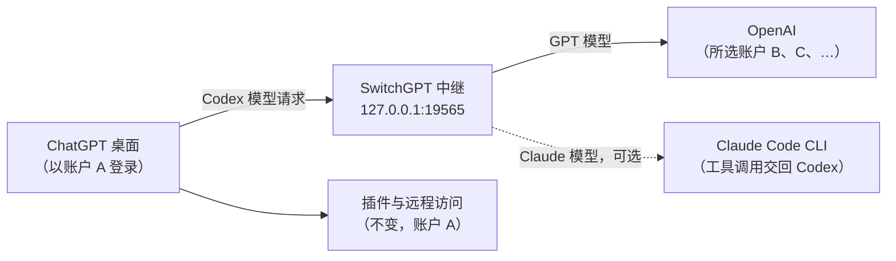

<p align="center">
  
</p>

<h1 align="center">SwitchGPT</h1>

<p align="center">
  <strong>保留插件与远程连接，只切换运行模型的账户。</strong>
</p>

<p align="center">
  <a href="https://github.com/yoonpooh/SwitchGPT/releases/latest"></a>
  
  
  
</p>

<p align="center">
  <a href="README.md">English</a> · <a href="README.ko.md">한국어</a> · <a href="README.ja.md">日本語</a> · <strong>简体中文</strong>
</p>

<p align="center">
  <a href="https://github.com/yoonpooh/SwitchGPT/releases/latest">下载</a> ·
  <a href="#快速开始">快速开始</a> ·
  <a href="#claude-模型可选">Claude 模型</a> ·
  <a href="#问题排查">问题排查</a> ·
  <a href="https://github.com/yoonpooh/SwitchGPT/releases">更新日志</a>
</p>

---

SwitchGPT 是一款 macOS 菜单栏应用，在保持 ChatGPT 桌面账户登录的同时，选择处理 Codex 模型请求的账户。GitHub 等插件以及对这台 Mac 的远程访问继续使用原有认证，模型请求则使用多个已保存账户的剩余额度。你还可以通过本机已登录的 Claude Code CLI，把 **Fable 5.1、Opus 5.5、Sonnet 5** 等 Claude 模型 加入模型选择器。

## 目录

- [功能特性](#功能特性)
- [0.4.4 新功能](#044-新功能)
- [工作原理](#工作原理)
- [系统要求](#系统要求)
- [安装](#安装)
- [快速开始](#快速开始)
- [使用方法](#使用方法)
- [自动切换](#自动切换)
- [Claude 模型（可选）](#claude-模型可选)
- [隐私与本地数据](#隐私与本地数据)
- [问题排查](#问题排查)
- [卸载](#卸载)
- [限制](#限制)
- [开发](#开发)
- [参与贡献](#参与贡献)
- [免责声明](#免责声明)

## 功能特性

- **保留桌面登录** — 切换模型账户时，保留插件连接和远程访问所用的桌面认证。
- **切换无需重启** — 首次连接后，下一个模型请求即使用所选账户。进行中的响应由原账户完成。
- **额度用尽自动切换** — 5 小时或每周额度用尽时，按列表顺序选择下一个可用账户。
- **查看实际处理账户** — 分别显示下次请求的账户、最近完成响应的账户和桌面登录账户。
- **用量一目了然** — 每个已保存账户都显示剩余额度、重置时间、套餐徽章、头像和重置次数。
- **Claude 模型（可选）** — 在 ChatGPT 模型选择器中通过 Claude Code 运行你的账户可用的 Claude 模型，所有工具调用均由 Codex 执行。
- **完全本地** — 认证信息保存在 macOS 钥匙串中，请求经本地中继直接发往 OpenAI。没有 SwitchGPT 服务器。
- **多语言** — 英语、韩语、日语和简体中文。

## 0.4.4 新功能

- **Claude 长时间任务不再中断：** Claude 安静工作时会发送 keepalive 事件，Codex 不会在 5 分钟后断开响应。如果连接仍然断开且 Codex 重试，会继续同一个 Claude Code 任务，而不是从头开始。
- **显示 Claude 用量上限：** Claude Code 达到会话、每周或模型上限时，Codex 会立即显示包含重置时间的 Claude 消息，而不是重连 5 次。

更早的变更请查看[发布页面](https://github.com/yoonpooh/SwitchGPT/releases)。

## 工作原理



| 连接 | 使用的账户 |
| --- | --- |
| ChatGPT 桌面登录 | 当前桌面账户 |
| GitHub 等已连接插件 | 已连接到应用的各服务账户 |
| 对这台 Mac 的远程访问 | 原有桌面登录和远程设置 |
| 这台 Mac 上的 Codex 模型请求 | SwitchGPT 中选择的账户 |
| Claude 模型请求（可选） | 本机 Claude Code CLI 的登录 |

例如，桌面保持 A 账户登录及其 GitHub 连接、远程设置，模型请求则由已保存的 B 账户处理。B 的额度用尽后，可自动切换到 C，无需更改桌面登录或重新连接插件。

适用于这台 Mac 上使用内置 `openai` 提供方的 Codex 请求，也包括通过远程连接在这台 Mac 上执行的请求。不会更改普通 Chat 对话、其他提供方，或在其他电脑、云端执行的模型请求。

## 系统要求

- 运行 **macOS 14 或更新版本**的 Apple 芯片 Mac
- 已安装并登录的当前 **ChatGPT 桌面应用**，须使用默认文件式认证路径 `~/.codex/auth.json`。SwitchGPT 使用应用自带的 CLI，无需单独安装 Codex CLI。
- 可选：如需使用 Claude 模型，需要已安装并登录的 [Claude Code](https://docs.anthropic.com/en/docs/claude-code) CLI

## 安装

### 下载

1. 从[最新版本](https://github.com/yoonpooh/SwitchGPT/releases/latest)下载 `SwitchGPT-v0.4.4-macos-arm64.zip` 和 `SHA256SUMS.txt`。
2. 将两个文件放在同一文件夹中，验证校验和：

   ```sh
   shasum -a 256 -c SHA256SUMS.txt
   ```

3. 解压 ZIP，将 **SwitchGPT.app** 移至**应用程序**。

### 首次启动

发布版采用 **ad-hoc 签名**，**未经 Apple 公证**。若 macOS 阻止启动，请确认下载来源并尝试打开应用，然后在选项可用时使用**系统设置 → 隐私与安全性 → 仍要打开**。请参考 [Apple 的说明](https://support.apple.com/en-ca/guide/mac-help/mh40616/mac)。受管理的 Mac 可能限制此选项。

### 更新

等待正在处理的模型响应完成，通过 `⋯` 退出 SwitchGPT，替换应用程序中的应用后重新打开。已保存账户和钥匙串条目位于应用包外，会被保留。由 0.1.x 更新时，如有提示，请完成首次连接步骤。

### 请 ChatGPT 帮忙安装

粘贴到可使用本地文件与终端工具的 ChatGPT 会话中：

```text
请从 https://github.com/yoonpooh/SwitchGPT 安装最新的 SwitchGPT 版本到这台 Mac。先确认 Mac 符合要求，下载应用 ZIP 和公开的 SHA256SUMS.txt，并在安装前验证校验和。保留所有已保存账户和钥匙串条目。如果 SwitchGPT 正在运行，请等待模型响应完成后退出它，替换 /Applications 中的应用并重新打开。不要代为登录、切换账户或重启 ChatGPT。如果 macOS 阻止首次启动，请指导我使用 Apple 针对单个应用的“仍要打开”步骤，不要禁用系统安全设置。
```

## 快速开始

1. 打开 SwitchGPT 并点击菜单栏图标。SwitchGPT 没有普通窗口或 Dock 图标。
2. 选择 **+**，通过浏览器登录添加账户。对每个要保存的账户重复操作。
3. 首次选择账户时，在 `⋯` 中关闭自动切换，然后点击账户卡片。若要按列表顺序使用，请重新开启自动切换。
4. 如有提示，请先完成正在进行的工作，再重启 ChatGPT。仅首次连接需要。
5. 在桌面应用中发送 Codex 请求，确认响应正常完成。

使用模型中继时，请保持 SwitchGPT 在菜单栏中运行。

## 使用方法

- **所选账户** — 在列表中突出显示，手动模式下可点击卡片更改。
- **桌面登录** — 在底部单独显示桌面登录账户。
- **自动切换** — 在 `⋯` 中默认开启，标题中显示自动或手动。
- **刷新** — 获取用量和可用重置次数。面板关闭时仍会在每次刷新完成 60 秒后自动刷新；登录、切换账户或正在刷新时会跳过。
- **账户管理** — 拖动卡片设置顺序；通过 `⋯` 或右键重命名、从保存列表移除账户。显示名称留空会恢复邮箱。从列表移除不会删除 OpenAI 账户本身。

### 重置次数

有剩余重置的账户卡片会显示 **重置 N 次**、最早到期时间（一天内到期时以橙色显示剩余时间）和 **使用** 按钮，额度不足或用尽时按钮会突出显示。点击 **使用**，或在账户右键菜单、更多菜单中选择 **使用重置…**，确认窗口会显示当前剩余额度和每次重置的到期时间，确认后使用 1 次重置。当前无法使用时会以弹窗说明原因，用量信息过期时可在弹窗中直接刷新。结果也以弹窗显示。使用后会重新查询限额和剩余次数，自动模式会重新应用账户优先级。若响应中断或后续刷新失败，可点击 **确认结果** 继续此前的请求。未确认的请求编号会在重启应用后保留，重置不会被自动使用。

### 语言与日期

日期采用 Mac 的时区和界面语言。更改 Mac 首选语言后请重新打开应用。不支持的语言回退为英语，其他中文地区或文字变体使用简体中文。

## 自动切换

1. 优先使用列表中近期查询确认可用的第一个账户。使用第 3 个账户时，若第 1 个账户额度恢复，会在查询确认恢复后的下一个请求中使用第 1 个账户。仅到达预计重置时间不会触发切回。
2. 如果服务器以 `usage_limit_reached` 拒绝请求，会在转发响应前换用可用账户重试。每个请求对每个账户最多尝试一次。
3. 已正常开始的流式响应由原账户完成，不会重新执行。
4. 临时速率限制和认证错误直接返回，不触发切换。用量查询失败或信息过期的账户不会被选为备选账户。
5. 如果所选账户已用尽且无法确认可用备选账户，请求会停止。请等待额度重置，或选择、添加可用账户。重置次数不会被自动消耗。

在 `⋯` 中关闭自动切换后，将继续使用所选账户并直接返回其额度错误。自动模式下，卡片顺序优先于手动选择，调整顺序会从下一个请求起生效。各账户额度仍各自独立。

## Claude 模型（可选）

在 `⋯` 中开启 **使用 Claude 模型** 后，账户可用的 Claude 模型会加入 ChatGPT 的模型选择器。它们通过本机已登录的 Claude Code CLI（`~/.local/bin/claude`、`/opt/homebrew/bin/claude` 或 `/usr/local/bin/claude`）运行。SwitchGPT 不读取 Anthropic 凭据；未安装 CLI 时该开关不可用。账户与套餐限额取自 Claude Code 自身的报告，显示在 ChatGPT 账户下方，查询时不会调用模型。

模型列表需重启后才会更新，因此切换时会询问是否重启 ChatGPT，并删除 `~/.codex/models_cache.json` 以获取新列表。

SwitchGPT 会向 Claude Code 查询可用模型（例如 Fable 5.1、Opus 5.5、Sonnet 5、Haiku 4.5），并分别以 Claude 模型 ID（例如 `claude-opus-5-5`）列出。Claude Code 更新后或每 6 小时，列表会在不调用模型的情况下重新获取，并在下次重启 ChatGPT 后出现在选择器中。每个模型以 Claude Code 的自动压缩阈值作为上下文窗口（1M 模型为 967K，Haiku 为 167K），因此 Codex 会先于 Claude Code 压缩线程，包括刚切换到窗口更小的模型时。

- **不消耗 OpenAI 额度** — Claude 请求同样经过本地中继和桌面登录校验，但不会选择 OpenAI 账户或消耗其额度。其他模型不受影响。
- **除网页搜索外，所有工具由 Codex 执行** — 除网页搜索外，Claude Code 不使用自带工具。其他工具调用都交回 Codex，按当前权限与审批设置执行，结果再返回同一个 Claude 进程。
- **压缩** — 手动和自动压缩都由当前使用的 Claude 模型生成摘要。
- **线程中途切换模型** — 在 Claude 模型之间切换会用完整历史启动新的 Claude 进程，也可以切换到 GPT 模型继续：SwitchGPT 只移除 OpenAI 会拒绝的 Claude 条目，并把 Claude 的压缩摘要转成可读消息。反方向有限制：GPT 模型压缩的摘要是加密的，Claude 只能从其后的消息继续，缺少早先上下文时会说明。
- **网页搜索** — Codex 开启网页搜索时，Claude 模型使用 Claude Code 自带的 WebSearch。搜索在 Anthropic 服务器上运行，计入 Claude 套餐用量，每次搜索都显示为 Codex 网页搜索卡片。同一对话改用 GPT 模型继续时，这些卡片不会发送给 OpenAI，回答中写明的来源保持不变。即使在 Codex 默认的 cached 模式下也始终搜索实时网页；若附带无法执行的域名限制，则不使用网页搜索。
- **托管工具** — 其他 OpenAI 托管工具在 Claude 模型中不可用，Claude 会被告知缺少哪些工具。

<details>
<summary>实现细节</summary>

- 开关关闭时，SwitchGPT 会在本地直接拒绝 Claude 请求，不会发往 OpenAI；关闭的同时也会结束正在运行的 Claude 任务。压缩请求（gzip、deflate、zstd）同样处理。zstd 需要 Homebrew 的 `zstd`；开关开启时，SwitchGPT 无法读取的请求会在本地直接拒绝，不会转发。
- Claude Code 在一个空的专用文件夹中运行，而不是线程所在文件夹，因此“文稿”等受保护文件夹中的线程或没有项目的新聊天不会卡在 macOS 权限提示上。Codex 工具仍在线程文件夹中运行。
- 若 Claude Code 在 90 秒内未启动或中途退出，Claude 响应会附带 Claude Code 的错误信息失败。
- 如果 `~/.codex/config.toml` 设置了 `model_catalog_json`，该列表会取代 SwitchGPT 添加了 Claude 模型的列表；开启 Claude 模型时 SwitchGPT 会给出提示。

</details>

## 隐私与本地数据

认证信息存储于 macOS 钥匙串。选择模型账户时保留 `~/.codex/auth.json`，将所选账户的认证读入内存。模型请求通过 `127.0.0.1:19565` 的中继直接转发至 OpenAI，没有外部 SwitchGPT 服务器。

| 本地数据 | 存储位置 |
| --- | --- |
| 账户列表和顺序 | `~/Library/Application Support/SwitchGPT/accounts.json` |
| 所选模型账户 | `~/Library/Application Support/SwitchGPT/routing-selection.json` |
| 自动切换、Claude 模型设置和连接状态 | `~/Library/Application Support/SwitchGPT/routing-preferences.json` |
| 未确认的重置请求编号 | `~/Library/Application Support/SwitchGPT/reset-credit-attempts.json`（含用于并发保存控制的 `.lock` 文件） |
| 请求元数据 | `~/Library/Application Support/SwitchGPT/relay-events.jsonl` |
| Claude 模型列表 | `~/Library/Application Support/SwitchGPT/claude-models.json` |
| 原有桌面认证 | `~/.codex/auth.json` — 保留 |

通过 `~/.codex/config.toml` 的管理区块设置 `openai_base_url`，并使用 HTTP 流式传输，让后续请求采用所选账户。本地日志记录不透明的账户标识、路径、模型、HTTP 状态、完成状态、令牌计数、客户端类型、时间及额度耗尽状态。**不记录提示词、响应内容或认证令牌。**

用量通过 OpenAI 的非公开端点 `chatgpt.com/backend-api/wham/` 获取，这些端点可能变化。若当前账户列表不存在，会复制旧存储位置的列表，并保留原文件及钥匙串条目。

## 问题排查

| 现象 | 处理方法 |
| --- | --- |
| 退出 SwitchGPT 后请求失败 | 重新打开它，或[移除中继设置](#卸载)。 |
| 首次连接一直待确认 | 如有重启按钮，请先使用，再在桌面完成实际 Codex 请求。用量刷新或 CLI 请求不会确认桌面连接。 |
| 账户需要重新登录 | 通过浏览器重新添加该账户。已保存账户会自动刷新，仅当刷新令牌过期或被撤销时需要重新登录。 |
| 用量显示为未知 | 缺失信息显示为未知，而不是剩余量为零。请尝试**刷新**。 |
| 提示自定义端点冲突 | SwitchGPT 不会覆盖其他中继的 `openai_base_url`。如需由 SwitchGPT 管理，请先移除原有设置。 |
| 模型选择器中没有 Claude 模型 | 切换开关后重启 ChatGPT；若 `~/.codex/config.toml` 中设置了 `model_catalog_json`，请将其移除。 |
| Claude 开关不可用 | 在支持的路径之一安装 Claude Code CLI 并登录。 |

## 卸载

1. 结束正在进行的工作。
2. 仅移除 `~/.codex/config.toml` 中的 `BEGIN/END SwitchGPT model routing` 区块，保留其他设置。
3. 重启 ChatGPT。
4. 通过 `⋯` 退出 SwitchGPT 并删除应用。如有需要，也可删除 `~/Library/Application Support/SwitchGPT` 和 SwitchGPT 的钥匙串条目。

只删除应用包会留下中继设置，在移除该区块之前模型请求都会失败。

## 限制

- 仅发布 Apple 芯片版本，Intel 未验证。
- 不支持 API 密钥认证、keyring/auto 认证存储、自定义 `CODEX_HOME` 或配置其他远程主机。对这台 Mac 的远程访问保留原有设置。
- 使用这台 Mac 内置 `openai` 提供方及相同配置的 CLI 会话也会经过中继。
- 没有内置应用更新器。当前桌面会话由 Codex 刷新令牌，SwitchGPT 同步其最新认证信息。
- 构建成功不代表兼容所有桌面或 macOS 版本。实际插件与远程行为需要单独验证。

## 开发

### 从源码构建

安装包含 Swift 6 和 macOS SDK 的 Xcode，并选择其命令行工具，然后运行：

```sh
git clone https://github.com/yoonpooh/SwitchGPT.git
cd SwitchGPT
./script/build_and_run.sh --verify
```

该命令构建 `dist/SwitchGPT.app` 并进行 ad-hoc 签名。若 SwitchGPT 未在运行，会短暂启动构建产物、确认其进程后再停止；若已安装的副本正在运行，则不会在 19565 端口启动竞争的中继。不会自动安装到应用程序文件夹。

```sh
./script/build_and_run.sh           # 构建并启动调试版
./script/build_and_run.sh --verify  # 构建并签名；仅在无运行副本时短暂启动验证
./script/build_and_run.sh --build   # 仅构建调试版，不启动
./script/build_and_run.sh --release # 仅构建优化版，不启动
swift test                          # 运行测试
```

尽量将仓库放在 iCloud Drive 之外。若同步文件夹导致与 Finder 信息或资源分支相关的代码签名错误，请使用独立的构建目录：

```sh
swift test --scratch-path /tmp/switchgpt-tests
```

测试使用合成凭据和临时文件，不会执行真实账户切换、使用重置次数或调用 Claude Code。真实认证与服务器兼容性需要单独验证。

### 打包发布版本

脚本针对构建所在 Mac 的架构进行构建。公开发布的文件为 Apple 芯片版本。

```sh
./script/build_and_run.sh --release
ditto -c -k --norsrc --keepParent dist/SwitchGPT.app dist/SwitchGPT-v0.4.4-macos-arm64.zip
(cd dist && shasum -a 256 SwitchGPT-v0.4.4-macos-arm64.zip > SHA256SUMS.txt)
```

### 项目结构

```text
favicon.png                     仓库徽标
Assets/                         应用与菜单栏图标
Sources/SwitchGPT/
  App/                          菜单栏应用入口
  Models/                       账户、用量、中继设置模型与本地化工具
  Resources/                    英语、韩语、日语、简体中文文案
  Services/                     中继、路由、登录、钥匙串、用量、Claude Code 集成
  Stores/                       账户状态与排序
  Views/                        账户面板与用量显示
Tests/SwitchGPTTests/           单元测试
script/build_and_run.sh         构建与应用打包入口
```

## 参与贡献

欢迎提交 Issue 和 Pull Request。提交前请确认：

- 运行 `swift test` 并确保通过。
- 面向用户的文案需同步到全部四个 `Localizable.strings` 文件；修改文档时请同时更新所有 README 译本。
- **切勿在 Issue、Pull Request 或提交中包含认证信息、账户列表或显示个人账户的截图。**

## 免责声明

SwitchGPT 是独立工具，与 OpenAI 或 Anthropic 无关联，也未获得其认可。ChatGPT、Codex、Claude 和 Claude Code 是其各自所有者的商标。SwitchGPT 依赖可能随时变化的非公开端点和桌面应用行为，使用风险由你自行承担。
